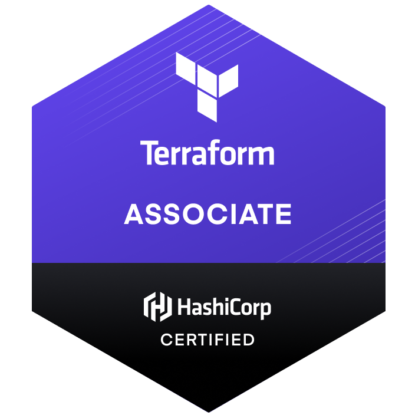
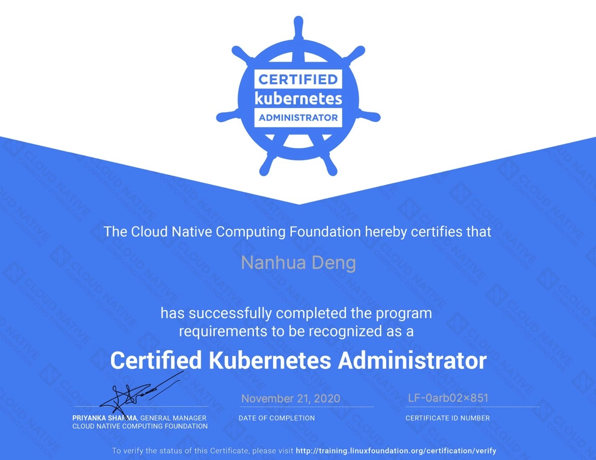

# About LarryDpk

Hi guys, I'm Larry Deng, a man and a new father. Welcome to my GitHub [LarryDpk](https://github.com/LarryDpk/LarryDpk). I'm a Java Developer based on Guangzhou now.

I'm writing tech articles on my webSite [www.pkslow.com](https://www.pkslow.com), hope you can find something useful for you.

Contacts:
- [WebSite](https://www.pkslow.com)
- [GitHub](https://github.com/LarryDpk)
- [Medium](https://pkslow.medium.com)

## Star History

## My Skills
- Java
- Maven
- Oracle/PostgreSQL/MySQL
- Spring/Spring Boot/Spring Cloud
- Docker
- Kubernetes
- GCP(Google Cloud Platform)
- DevOps

## Certificates
- 2021-12-18 Terraform Associate
- 2020-11 Certificated Kubernetes Administrator
- 2011-12 CET-6 (College English Test)

---

# 关于南瓜
大家好，我是南瓜，欢迎来到我的GitHub。我是一名在广州的Java开发。
我会持续在我的个人网站[南瓜慢说](https://www.pkslow.com)上输出一些技术文章，希望能帮助到大家。

## 我的技术栈
- Java
- Maven
- Oracle/PostgreSQL/MySQL
- Docker
- Kubernetes
- GCP(Google Cloud Platform)
- DevOps

## 证书
- 2021-12 Terraform Associate
- 2020-11 Certificated Kubernetes Administrator
- 2013-06 学校优秀毕业生
- 2012-12 优秀学生
- 2012-09 北京市大学生机器人大赛创意设计赛竞赛项目三等奖
- 2012-06 北京市电子设计竞赛三等奖
- 2011-12 大学英语六级
- 2011-09 全国大学生数学建模大赛北京市一等奖

## IT资源收集整理
[IT资源收集整理](ITResources.md)

